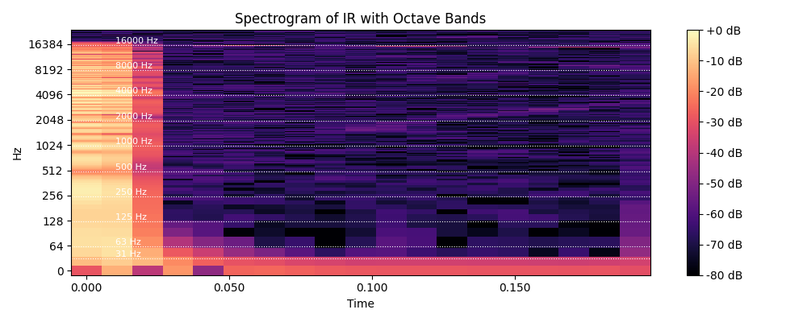

# Impulse Response Application in Python

This project demonstrates how to apply an impulse response (IR) to an audio file using Python and a Jupyter Notebook.

You will learn how to:

- Load and visualize impulse responses
- Apply an IR to a dry audio file using FFT-based convolution
- Analyze the spectral and temporal characteristics of the IR
- Estimate the reverberation time (RT60)

---

## Setup Instructions

1. **Clone the repo and navigate to the project folder:**

```bash
git clone <your-repo-url>
cd apply_ir_project
````

2. **Create and activate a virtual environment:**

```bash
# Create
python3 -m venv venv

# Activate
# macOS/Linux:
source venv/bin/activate

# Windows:
venv\Scripts\activate
```

3. **Install requirements:**

```bash
pip install -r requirements.txt
```

4. **Launch Jupyter in VS Code:**

Open the `apply_ir.ipynb` file in VS Code and select the interpreter from the virtual environment.

---

## Dependencies

* `numpy`
* `scipy`
* `librosa`
* `soundfile`
* `matplotlib` (for visualizing waveforms)

---

## Notebook Features

### 📈 Waveform Visualization

Plots the original dry audio and convolved wet audio waveforms for visual comparison.

### 🔊 Spectrogram of Impulse Response

A log-frequency spectrogram shows how energy decays over time and at what frequencies, helping visualize reflections and reverb tails.

### ⏱️ RT60 Estimation

Using the Schroeder integration method, the notebook estimates the RT60 (time it takes for the signal to decay by 60 dB). This gives insight into the reverberant character of the impulse response.

### 💾 Output Audio

The convolved result is saved as `audio/output_wet.wav`.

### 📷 Spectrogram Preview



### 📷 Waveform Comparison


---

## Notes

* Place your impulse response in `audio/impulse_response.wav`
* Place your dry audio input in `audio/dry_audio.wav`
* Output will be saved to `audio/output_wet.wav`

---

## ✅ Folder Structure

```
apply_ir_project/
│
├── README.md
├── requirements.txt
├── apply_ir.ipynb
└── audio/
    ├── impulse_response.wav
    ├── dry_audio.wav
    └── output_wet.wav  # generated after running the notebook
```
